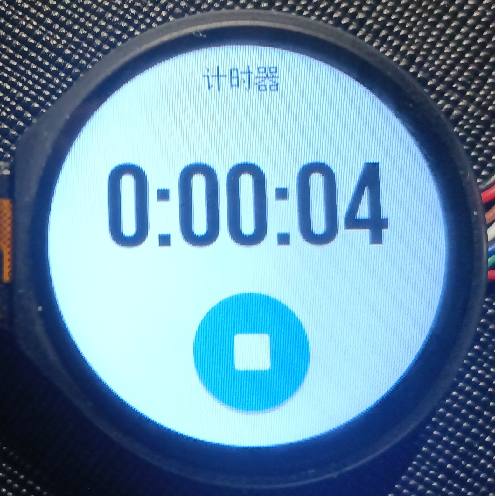

# 应用使用说明

## 日历

日历应用用于查看日历，使用手势操作，上下滑动可以切换月份，右划退出，左划回到当前日，这里还使用了 LVGL 9.2 新增的中国日历模式，可以显示农历、节气和中国传统节日。

## 设置

设置应用用于调整系统设置，包括启用和禁用勿扰模式，调整亮度和音量，设置用户的身高、体重和步长，查看系统信息，进行重新启动和恢复出厂设置。支持点击左侧按钮或者右划退出。

## 闹钟

闹钟应用用于查看和设置闹钟，主页显示闹钟列表和表示启用状态的开关，以及新建闹钟按钮。点击开关可以切换闹钟的启用状态，点击新建或者某个已有的闹钟将进入闹钟设置页面。

闹钟设置页面可以选择闹钟的时间和设置闹钟在一周的哪些天有效，如果一天也不选则表示这是一次性闹钟。下方的两个按钮分别表示完成和删除闹钟。

在闹钟应用主页，可以通过右划或者点击左侧按钮退出。

## 心率

心率应用用于实时测量用户心率。启动时自动启用传感器，一段时间的数据采集后开始周期性计算心率，并以柱状图方式显示最近 10 次测量数据。顶部展示当前心率值。

退出应用时自动关闭传感器，支持右滑手势退出。

## 天气

天气应用用于显示从 Gadgetbridge 应用程序获取的天气数据，界面上方将显示当前的位置和温度，下方显示详细的天气信息，包括天气、最高温度和最低温度、风向和风速、湿度、降雨率、紫外线指数和数据的更新时间。如果数据超过 12 个小时未更新，或者无法获取有效天气信息，则显示一条消息用于提示。

为了提升视觉体验，天气应用的背景会随着当前天气的变化而改变，例如晴天白天时，天气应用将拥有橙色背景，而雨天则是蓝色背景。

使用手势操作，右滑退出。

## 计时器

计时器用于测量从特定时刻开始经过的时间。其界面上方为时间显示，下方为控制按钮。

有三种状态，初始状态下，时间显示为 0 而按钮显示开始，此时计时没有开始。而点击按钮后，进入计时状态，时间将发生变化，按钮显示停止符号。按下停止符号后，时间变化将停止，同时按钮显示重置符号。按下按钮后，回到初始状态。

在计时器应用中，可以通过右滑手势退出应用。

计时开始后，使用全局变量保存开始计时时的 Unix 时间戳，因此即使退出应用，计时仍然不会结束，再次进入应用即可看到计时。这种设计允许用户在使用手表计时时，从计时界面退出，完成其他任务而不中断计时。

## 音乐控制

音乐控制是 Gadgetbridge 通信协议服务提供的一项功能，允许用户从手表上控制手机的音乐播放，音乐控制应用为其提供了图形界面。

界面设计上，采用类似 CD 播放器控制面板的用户界面，中间为五颗按钮，分别用于播放/暂停、切换前一首和后一首、调整音量，外围为一个圆弧组件，显示播放进度，中间上方为当前音乐名称、作曲家和专辑显示。

使用手势操作，右滑退出。

## 蜂鸣器琴

蜂鸣器琴是一个简单的娱乐应用，它只包含8个按钮，按钮上显示音调符号，按下按钮后，将控制蜂鸣器发出相应音调。

可以通过点击退出按钮或者右划退出应用。

## 电子木鱼

点击木鱼增加功德并发声，最初只是用于测试而编写的应用。可以通过点击退出按钮或者右划退出应用。

## 测试器

开发时为了快速测试内置功能而编写的应用程序，可以通过右划或者点击左侧按钮退出。

## SimuCtrl

仅在模拟器上可用，用于控制模拟诸如运动输入、蓝牙指令到来等无法在模拟器上实现的功能，可以通过右划或者点击左侧按钮退出。