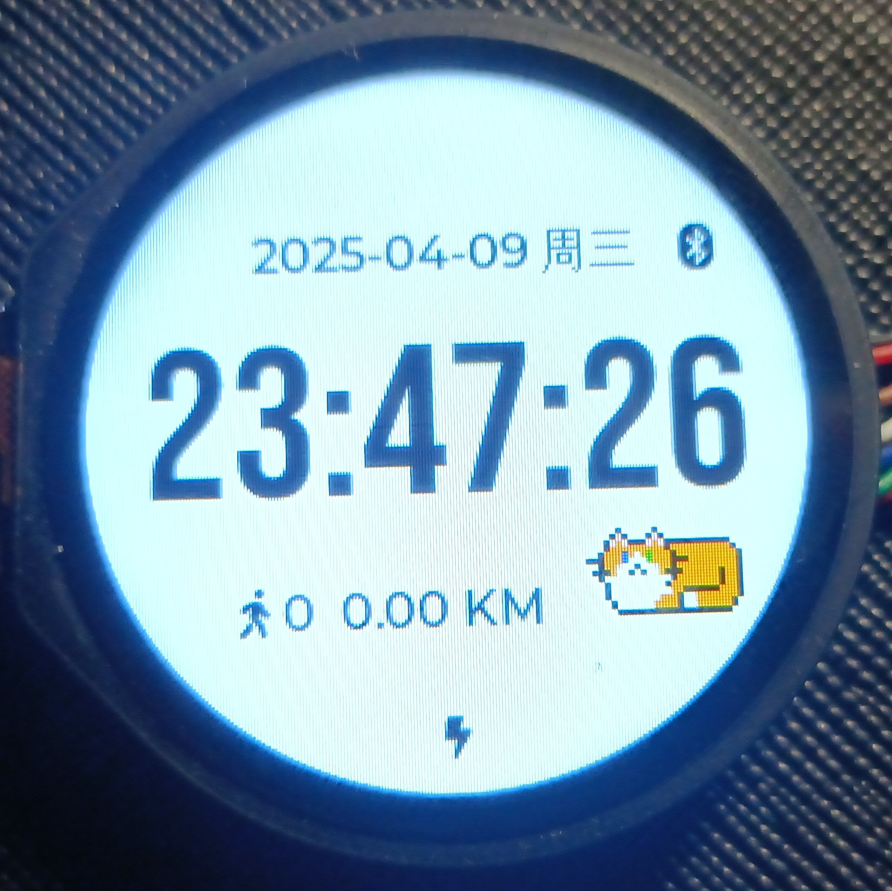
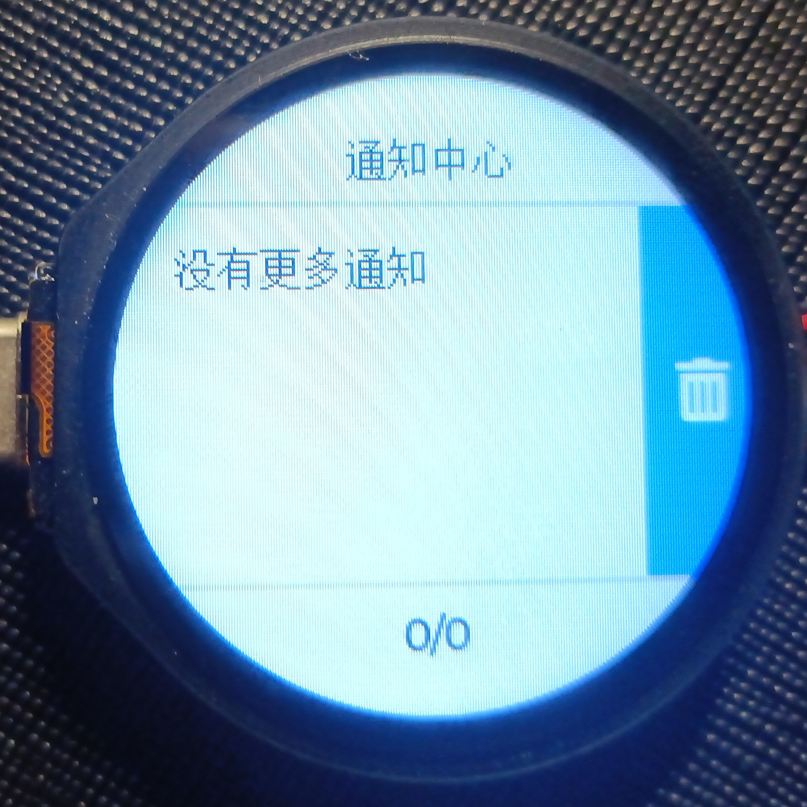
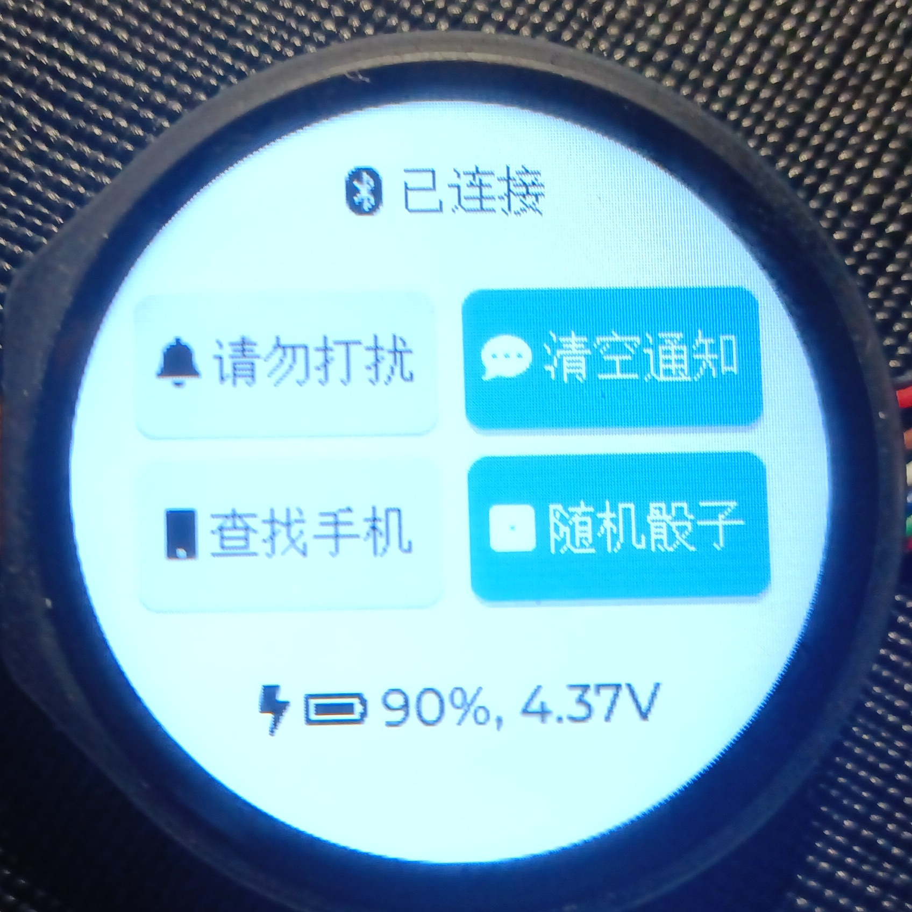
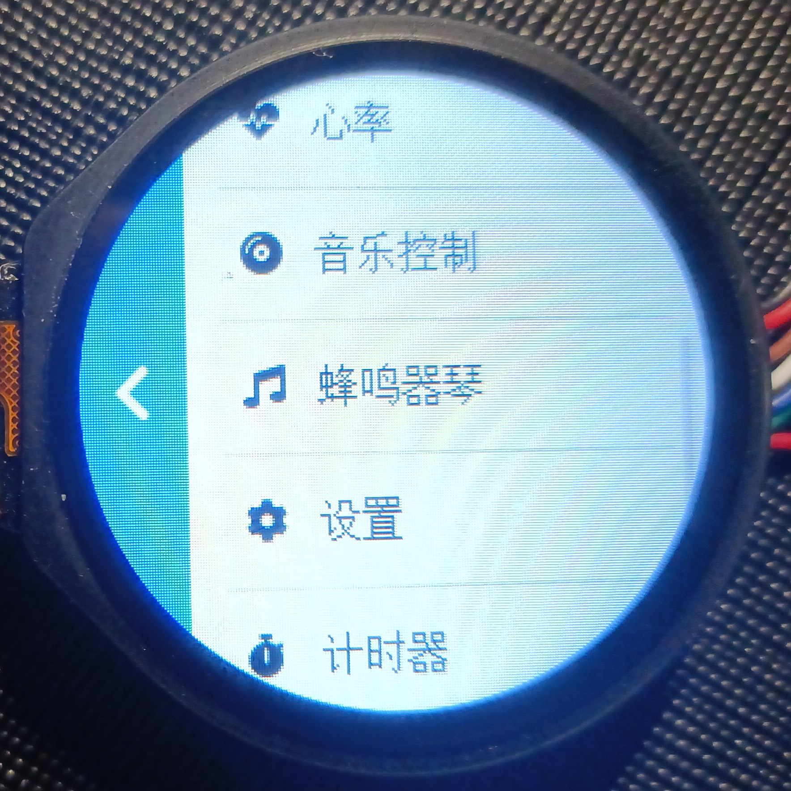

# 系统基本使用

## 表盘

显示：日期、时间、电量、蓝牙状态、步数、里程。

下划打开通知中心，上划打开快速设置，左划打开应用启动器，右划启动日历应用。

## 通知中心

展示通知，上下滑动查看历史通知，右侧按钮删除通知。上划时，如果是最新一条通知则回到表盘页面，在“没有更多通知”界面点击右侧按钮清空全部通知。

## 快速设置

显示蓝牙状态、电量。开关勿扰模式，查找手机，一键清空通知，生成随机骰子。下划回到表盘界面。

## 应用启动器

列表，显示所有应用，点击应用启动，点击左侧按钮或右划回到表盘界面。

